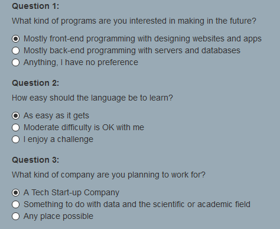
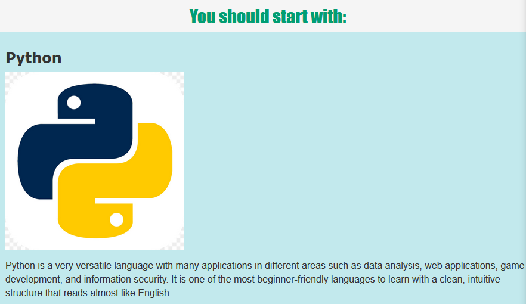

# _Programming Language Suggester_

#### _Week 2 Independent Friday Assignment for Epicodus, 01.17.2020_

#### By _**Tiffany Siu**_

## Description

_This site is the Week 2 Friday independent assignment for Epicodus' full time Intro to Programming and C#/React course.  It has a quiz on which coding language someone should learn first and then calculates a result depending on the input provided.  The calculation for which result to show is from how many times an answer corresponding to a specific result is chosen.  If there was a tie between two results, a random result between them would be chosen and displayed._

## Setup/Installation Requirements

### Requirements to Run
* _Web Browser_

### Other Resources Used
* _JQuery_
* _Bootstrap_

_This page may be viewed by cloning the repository from GitHub and opening the index.html file in any web browser._

## Technologies Used

* _HTML_
* _CSS_
* _Javascript_
* _JQuery_
* _Bootstrap_
* _Markdown_

## Notable Features
_Although it was not covered in class yet, the calculations for determining the result to display uses loops to find which answer was picked the most.  The calculations also account for if there is a tie between multiple results and uses a randomizer to chose between the results that are currently in a tie._

## Screenshots

_Here is a snippet of what the quiz looks like:_

_Here is what the results look like:_

## Known Bugs

_There are currently no known bugs in this program_

## Support and contact details

_If there are any question or concerns please contact me at my [email](mailto:tsiu88@gmail.com). Thank you._

### License

*This software is licensed under the MIT license*

Copyright (c) 2020 **_Tiffany Siu_**
